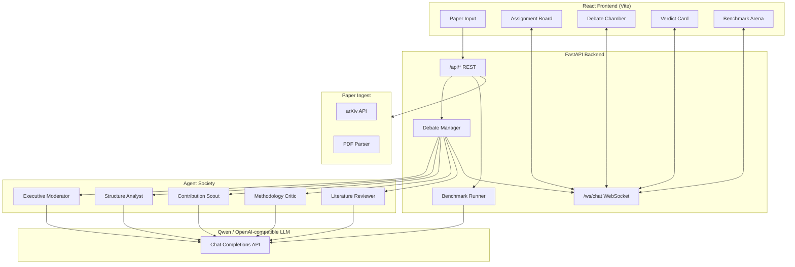
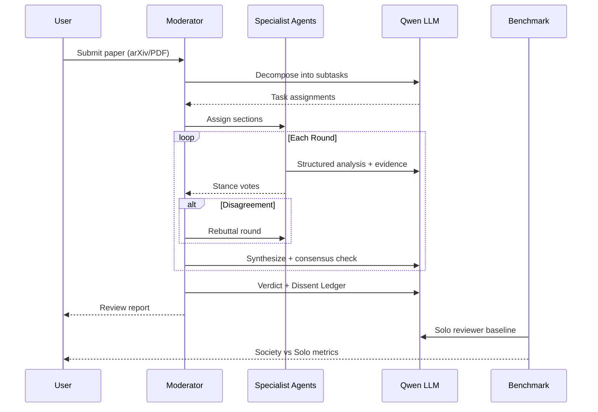

# Research Society — Architecture

Track 3: Agent Society submission for the [Qwen Cloud Hackathon](https://qwencloud-hackathon.devpost.com/).

## System Overview



## Debate Workflow



## Key Components

| Component | Path | Role |
|-----------|------|------|
| Debate Manager | `backend/debate/manager.py` | Orchestrates planning, rounds, rebuttals |
| Structured Responses | `backend/debate/structured.py` | JSON agent output with evidence anchors |
| Consensus Detector | `backend/debate/consensus.py` | Vote aggregation and threshold checks |
| Benchmark | `backend/debate/benchmark.py` | Society vs solo reviewer comparison |
| Executive Moderator | `backend/agents/executive_moderator.py` | Task decomposition, synthesis, verdict |
| Paper Fetcher | `backend/paper_ingest/fetcher.py` | arXiv/DOI identify + PDF download |

## API Endpoints

| Endpoint | Method | Description |
|----------|--------|-------------|
| `/api/paper/fetch-full` | POST | Identify paper + extract sections |
| `/api/debate/start` | POST | Full society debate with streaming |
| `/api/debate/plan` | POST | Preview task decomposition |
| `/api/benchmark/compare` | POST | Society vs solo reviewer metrics |
| `/api/map/generate` | POST | Concept map SVG |
| `/api/fact-check/verify` | POST | Claim verification |
| `/ws/chat` | WS | Real-time debate events |

## Track 3 Alignment

1. **Task division** — `decompose_tasks()` assigns paper sections to specialists
2. **Dialogue** — Hand-raising debate with WebSocket streaming
3. **Negotiation** — Rebuttal rounds + dissent ledger on unresolved disagreements
4. **Measurable gain** — `/api/benchmark/compare` scores coverage vs single-agent baseline

## Local Development

```bash
# Backend
cd backend && source venv/bin/activate
uvicorn main:app --reload --port 8000

# Frontend
cd frontend && npm run dev
```

Configure LLM in `backend/.env`:
```env
API_BASE_URL=http://localhost:11434/v1
MODEL_NAME=qwen
```
